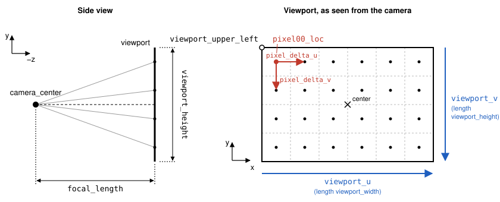

Viewport
########

We send one ray per pixel, from the camera through a virtual "viewport": a rectangle placed at a distance ``focal_length`` in front of the camera, discretized by the number of pixels of the image. The camera looks towards :math:`-z`, with :math:`y` pointing up and :math:`x` to the right.

   Left: the camera and the viewport seen from the side. Right: the viewport as seen from the camera, with the vectors used to locate the pixel centers.

- Introduce ``constexpr double aspect_ratio = 16.0 / 9.0;`` and compute ``image_height`` from ``image_width / aspect_ratio`` instead of the hard-coded value used so far.
- Define ``viewport_height`` (an arbitrary value, e.g. ``2.0``), and deduce ``viewport_width`` from it using the *real* ratio between the image's width and height in pixels (not the nominal ``aspect_ratio``, since integer rounding of ``image_height`` means they can differ slightly). Define also ``focal_length``, the distance between the camera and the viewport.
- Define a ``point3`` for the camera center (e.g. the origin), ``vec3`` objects ``viewport_u`` and ``viewport_v`` for the viewport's full width and height vectors (``viewport_u`` points right, ``viewport_v`` points *down*, since pixel rows are stored from top to bottom), then divide them by the pixel counts to get ``pixel_delta_u``/``pixel_delta_v``, the spacing between adjacent pixel centers.
- Define a ``point3`` for the center of the top-left pixel (``pixel00_loc``), computed from the viewport's upper-left corner (``viewport_upper_left``, obtained from the camera center by moving ``focal_length`` towards :math:`-z`, then half of ``viewport_u`` and ``viewport_v`` backwards) plus half a pixel step in each direction.
- Refactor the pixel loop to compute, for every pixel, the ``point3`` at its center (``pixel00_loc`` plus the appropriate multiples of ``pixel_delta_u``/``pixel_delta_v``) and build a ``ray`` from the camera through that point.

A ``ray`` is now built for every pixel, from the camera through that pixel's center — but it isn't used to compute a color yet. Replace the pixel color with a flat placeholder, e.g. ``color(0.5, 0.5, 0.5)``, until the next step. You may get an "unused variable" warning for the new ``ray`` until then; that's expected.

Rebuild and run: the window should show a uniform gray image.
