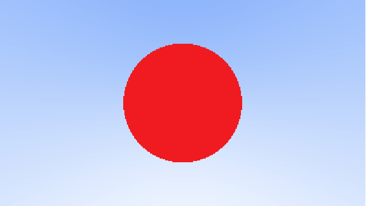

A first image with an obstacle
################################

Write a function that tells whether a ray intersects a sphere:

.. code-block:: cpp

    bool hit_sphere(const point3& center, double radius, const ray& r);

This comes directly from solving :math:`\|P(t) - C\|^2 = r^2` for ``t``, where ``P(t) = r.at(t)`` and ``C``/``r`` are the sphere's center and radius: a quadratic equation in ``t``, which has a real solution exactly when its discriminant is non-negative.

Change ``ray_color`` to return red when the ray hits a sphere centered at ``(0, 0, -1)`` with radius ``0.5``.

   ``center=point3(0, 0, -1)``, ``radius=0.5``

Now change ``hit_sphere`` to return the *distance* to the intersection instead of just whether one exists:

.. code-block:: cpp

    double hit_sphere(const point3& center, double radius, const ray& r);

(return a negative value when there is no intersection), and use it in ``ray_color`` to display normals on the sphere by mapping each normal component from :math:`[-1, 1]` to :math:`[0, 1]`. A surface normal always has unit length, so each of its components is between -1 and 1; adding 1 and halving maps that to the 0-to-1 range a color needs.

.. figure:: ../../_static/img/normal_on_sphere.png

   Surface normals mapped to colors.
