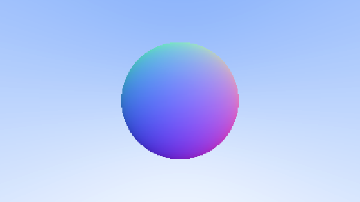

First use of an abstract obstacle
###################################

.. important:: Required reading: :ref:`stl/memory:smart pointers`.

To actually use ``hittable`` and ``sphere``, rewrite ``ray_color`` to take a ``const hittable&`` and call its ``hit`` method:

.. code-block:: cpp

    color ray_color(const ray& r, const hittable& world);

Call ``world.hit(r, t_min, t_max, rec)`` with ``t_min = 0`` and ``t_max`` set to ``std::numeric_limits<double>::infinity()`` (``#include <limits>``) — there's no sensible finite upper bound on how far away an obstacle can be.

Own the sphere through a ``std::shared_ptr<hittable>``, created before the pixel loop, and pass it (dereferenced) into ``ray_color`` from inside the loop.

``std::shared_ptr<hittable>`` lets the variable holding it refer to *any* type derived from ``hittable`` — today a ``sphere``, but the rest of the program doesn't need to know or care which concrete obstacle it is.

You should get exactly the same image as the previous step's normal-shaded sphere.

   Same result as before, now computed through the ``hittable`` interface.
