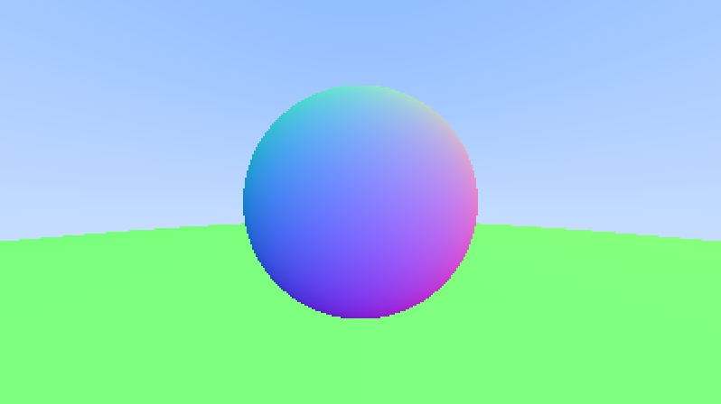

List of obstacles
##################

A single ``hittable`` is limiting — define a ``class hittable_list : public hittable`` holding any number of them, itself implementing ``hittable`` so it can be used exactly like a single obstacle:

- Data members: ``std::vector<std::shared_ptr<hittable>> objects``.
- Member functions: ``void add(std::shared_ptr<hittable> object)``, and the overridden ``hit``, which should loop over all the objects to find the *closest* hit along the ray.

.. important:: Shrinking the upper bound passed to each object's own ``hit`` call, down to the closest ``t`` found so far, is what guarantees the *closest* object wins when several overlap along the same ray — without it, whichever object happens to be checked last would win instead, which looks fine until two obstacles actually overlap on screen.

.. note:: ``hittable_list.hpp`` is a new header; remember to add ``#include "hittable_list.hpp"`` to ``src/main.cpp``.

Replace the single sphere with a ``hittable_list`` holding two: one at ``(0, 0, -1)`` with radius ``0.5``, and one at ``(0, -100.5, -1)`` with radius ``100`` (acting as a ground plane). Since it's now a plain object rather than a pointer, call ``ray_color`` without dereferencing it.

   Sphere at :math:`(0, 0, -1)` with a radius of :math:`0.5`, and :math:`(0, -100.5, -1)` with a radius of :math:`100`.

This is as far as this project goes. The project is taken from `Ray Tracing in One Weekend <https://raytracing.github.io/books/RayTracingInOneWeekend.html>`__, and it goes considerably further — antialiasing, diffuse materials, reflections and more — if you'd like to continue.
