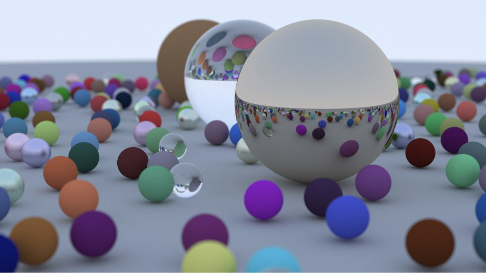

Ray tracer
##########

This project is adapted from `Ray Tracing in One Weekend <https://raytracing.github.io/books/RayTracingInOneWeekend.html>`__ by Peter Shirley, Trevor David Black and Steve Hollasch. It stops partway through the book; if you enjoy it, the book goes much further.

   Where *Ray Tracing in One Weekend* ends up — this project covers its first steps.

.. toctree::
    :maxdepth: 1

    01_setup
    02_create_image
    03_vec3
    04_rays
    05_viewport
    06_sending_rays
    07_first_obstacle
    08_hittable
    09_shared_ptr
    10_hittable_list
